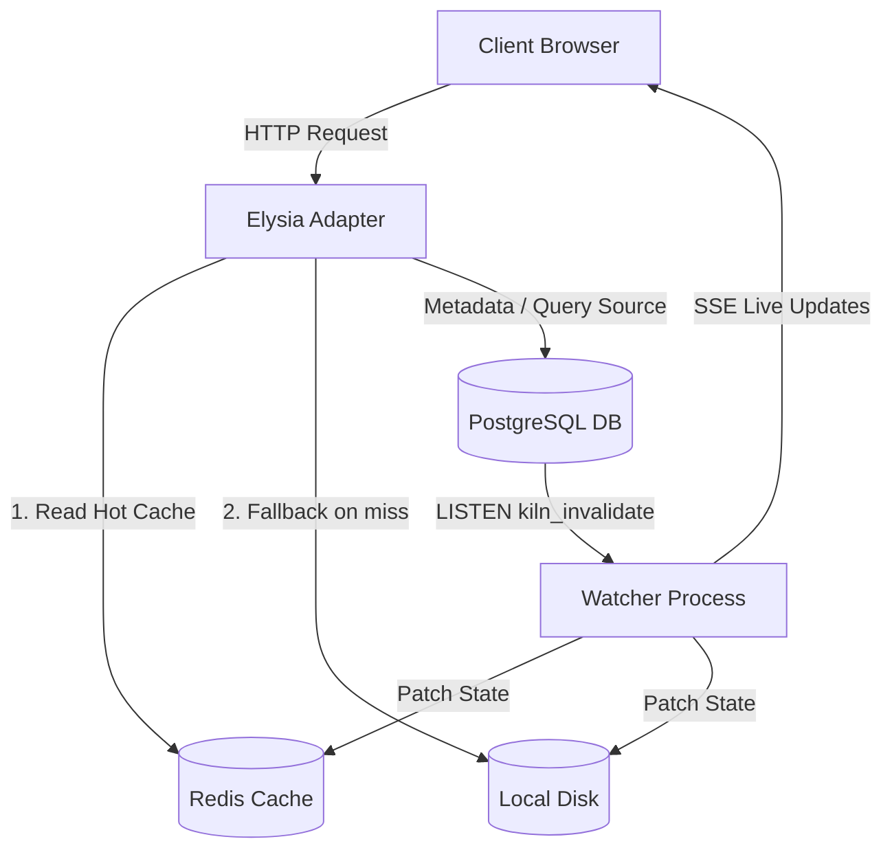

# FSR.js System Architecture

FSR.js is a TypeScript monorepo implementing **Field-Selective Rendering (FSR)** for the JavaScript/Bun ecosystem. It is the JavaScript port of Kiln's FSR paradigm, allowing field-level rendering granularity at the HTML baking layer.

## Monorepo Package Layout

The codebase is structured into the following packages under the `packages/` directory:

*   **[packages/core](file:///Users/jagjeet/Development/workspaces/Kiln/packages/core)**: Core primitives, configuration setups (`defineConfig`, `loadConfigFromEnv`), error handling abstractions (`Result<T>`), and the [LiveProp](file:///Users/jagjeet/Development/workspaces/Kiln/packages/core/src/live-prop.ts) definition.
*   **[packages/engine](file:///Users/jagjeet/Development/workspaces/Kiln/packages/engine)**: Stateful backend logic containing:
    *   [FsrStore](file:///Users/jagjeet/Development/workspaces/Kiln/packages/engine/src/store.ts): Manages PostgreSQL interaction for caching state metadata.
    *   [RedisCache](file:///Users/jagjeet/Development/workspaces/Kiln/packages/engine/src/cache.ts): Redis connection wrapper and cache operations.
    *   [FsrWatcher](file:///Users/jagjeet/Development/workspaces/Kiln/packages/engine/src/watcher.ts): Supervisor process that reconciles stale state and issues updates.
    *   [baking.ts](file:///Users/jagjeet/Development/workspaces/Kiln/packages/engine/src/baking.ts): Server rendering of layout and page components to static HTML templates.
    *   [hub.ts](file:///Users/jagjeet/Development/workspaces/Kiln/packages/engine/src/hub.ts): Server-Sent Events (SSE) stream coordinator for pushing live patches.
    *   [db-notify.ts](file:///Users/jagjeet/Development/workspaces/Kiln/packages/engine/src/db-notify.ts): Listen/notify pipeline for database triggers.
*   **[packages/adapter-elysia](file:///Users/jagjeet/Development/workspaces/Kiln/packages/adapter-elysia)**: Elysia-specific middleware, route registration, and SSE response handling.
*   **[packages/routekit](file:///Users/jagjeet/Development/workspaces/Kiln/packages/routekit)**: Route graph compilation, discovery, and HTTP request negotiation.
*   **[packages/react](file:///Users/jagjeet/Development/workspaces/Kiln/packages/react)**: Frontend React hooks (`useLive`, `useSubmit`).
*   **[packages/client](file:///Users/jagjeet/Development/workspaces/Kiln/packages/client)**: Browser runtime (`silcrow.js`) that connects to the SSE stream and surgically patches DOM elements.
*   **[packages/cli](file:///Users/jagjeet/Development/workspaces/Kiln/packages/cli)**: Scaffolding and development server utilities.

---

## 3-Layer Storage Model

FSR.js operates on a strict three-tier storage model to guarantee performance and multi-instance scaling:



1.  **Redis** (Serve Layer + Event Bus): Source of truth for baked HTML/JSON on promoted routes. Handles SSE updates and invalidation notifications. Redis is **required** infrastructure.
2.  **PostgreSQL**: Durable metadata database storing cache state, dependency links, hit counts, and real application data.
3.  **Local Disk**: Recovery backup for baked HTML/JSON, written synchronously alongside every Redis write. Read as a fallback on *any* Redis cache miss (key absent, or Redis unreachable) — not only during the initial cold-start boot, though that's the most common case. This is what lets a route keep serving cached content through a transient Redis outage. See ADR-002 in `decisions.md` for the reasoning.

---

## Schema Structures

### Database Schema (`kiln_fsr`)

All cache metadata is persisted in a single table:

```sql
CREATE TABLE kiln_fsr (
  route           TEXT,
  slot            TEXT,          -- '' = route-level, 'field_name' = slot-level
  query           TEXT,          -- SQL query to re-execute on invalidation
  query_params    JSONB,
  depends_on      TEXT[],        -- Array of dependency keys (e.g. 'contacts:id=42')
  stale           BOOLEAN DEFAULT FALSE,
  version         INT DEFAULT 1,
  hit_count       INT DEFAULT 0,
  promoted        BOOLEAN DEFAULT FALSE,
  promote_after   INT,           -- Hit threshold before caching (0 = SSG, NULL = SSR)
  debounce_secs   INT,
  html_path       TEXT,          -- Path to baked HTML shell on disk
  json_path       TEXT,          -- Path to baked JSON data on disk
  checksum        TEXT,
  last_hit        TIMESTAMPTZ,
  purge_after     INT,           -- TTL before cache eviction
  PRIMARY KEY (route, slot)
);
```

### Redis Key Schema

*   `kiln:html:<route>`: String holding full baked HTML.
*   `kiln:json:<route>`: String holding baked JSON (if JSON mode is active).
*   `kiln:slot:<route>`: Hash containing field slot values `{ slot_name: value }`.
*   `kiln:meta:<route>`: Hash containing route version, baked timestamp, and promotion state.
*   `kiln:layout:html:<pattern>`: String holding a layout's baked HTML shell, keyed by the layout's own URL *pattern* (e.g. `/dashboard`), not by any concrete route under it. See "Layout-Level (Pattern-Scoped) Caching" below.
*   `kiln:layout:json:<pattern>`: String holding a layout's baked JSON snapshot, same keying as above.

---

## Layout-Level (Pattern-Scoped) Caching

Page HTML is cached per concrete route (`kiln:html:/dashboard/reports/summary`). Layouts (`_layout.tsx` files) are cached **per pattern** instead (`kiln:layout:html:/dashboard`), shared by every route nested under that pattern. This means a shared header/footer/sidebar is baked once, not once per route beneath it, and a deploy that changes only layout code invalidates a single cache entry instead of every route's own page cache.

### The load()-scoping rule

A layout is only safe to cache once-per-pattern if its `load()` output is identical for every request that pattern matches. Concretely: a layout's `load(req)` may read `req.params` **only** for path segments owned by its own pattern (e.g. a layout at `/dashboard/:teamId` may read `params.teamId`), and must never read `req.query` or a descendant page's params. Data that legitimately varies per-request (search params, per-visit state) has to be pushed down to the page itself or resolved client-side — it cannot live in a layout's `load()`.

Data that is universal but changes *over time* (e.g. a live notification count shown in every page's header) is not a violation of this rule — it should use `LiveProp`/`Live.list` so the layout bakes once and the value is patched in-place via SSE, rather than being re-baked.

This rule is enforced by convention/code review, not by a runtime check. `examples/address-book`'s `ContactsLayout` currently violates it (reads `req.query.q` / `req.params.id`) and was intentionally **not** migrated to pattern-level caching — it still uses the old per-route full-page bake path. Only `test-app`'s demo layouts (`pages/_layout.tsx`, `pages/dashboard/_layout.tsx`, `pages/dashboard/reports/_layout.tsx`) were converted.

### Bake/read flow (`boot.ts`, `buildPageHandler`)

1. For each layout in the page's chain, check `cache.getLayoutHtml(pattern)`. On a hit, reuse it (re-injecting any `LiveProp` values via `materializeBakedShell`) — `load()` does not run again.
2. On a miss, run the layout's `load()`, bake, apply live markers, and write both `cache.setLayoutHtml(pattern, ...)` and `cache.setLayoutJson(pattern, ...)`.
3. The page itself is always baked fresh per request (pages are never pattern-cached).
4. Responses that hit the pattern-level layout cache set the `x-kiln-layout-cache-hit` header (comma-separated list of patterns served from cache) for observability.

### Invalidating a layout: `cache.deleteLayout(pattern)`

Removes just that one pattern's Redis + disk entries. Every route under it picks up the change on its next request — no per-route re-bake required.

### Staleness detection for already-promoted pages (`layoutSignature`)

A promoted page's own full-HTML cache entry (`kiln:html:<route>`) embeds its layouts' HTML *as it looked at bake time*. Simply invalidating the layout cache does nothing to that already-baked page snapshot — it would otherwise keep serving stale layout chrome forever, since a promoted route's cache-hit path never re-visits the layout cache.

To fix this, every page-level `BakedSnapshot` stores a `layoutSignature`: a fingerprint (`pattern:hash(html)` joined per layout) of the exact layout cache entries the page was assembled from, computed by `computeLayoutSignature()` in `boot.ts`. On every promoted-cache-hit request, the current signature is recomputed from the live layout cache and compared; a mismatch (any ancestor layout re-baked or invalidated since) is treated exactly like a missing/corrupt page cache — the page is deleted and fully re-baked. This is what makes `deleteLayout()` alone sufficient to propagate a layout change to *every* route beneath it, including ones that were already promoted.

---

## Cache Invalidation Pipeline

```
[Application Database Mutation]
  │
  ├─► Trigger / Transaction writes event to `contact_events`
  └─► SQL Trigger issues: pg_notify('kiln_invalidate', '{"depKey": "contacts", "id": 42, "op": "UPDATE"}')
        │
        ▼
[db-notify.ts: startDbNotificationPipeline]
  │
  ├─► Receives PG notification payload
  └─► Resolves dependency key and calls watcher.notifyChange("contacts:id=42")
        │
        ▼
[FsrWatcher: watcher.ts]
  │
  ├─► Sets `stale=TRUE` in database where `depends_on` matches key
  ├─► Publishes payload to Redis channel `kiln:invalidate`
  ├─► Re-runs SQL queries for stale slots
  ├─► Re-bakes dynamic slot values to Redis hash and disk
  └─► Publishes patch payload to Redis channel `kiln:patch`
        │
        ▼
[hub.ts: SSE Hub]
  │
  ├─► Receives Redis patch message
  └─► Pushes SSE `patch` event to all active browsers matching route
        │
        ▼
[silcrow.js: Client Patcher]
  │
  └─► Surgically mutates DOM elements containing `s-live="slot_name"`
```
