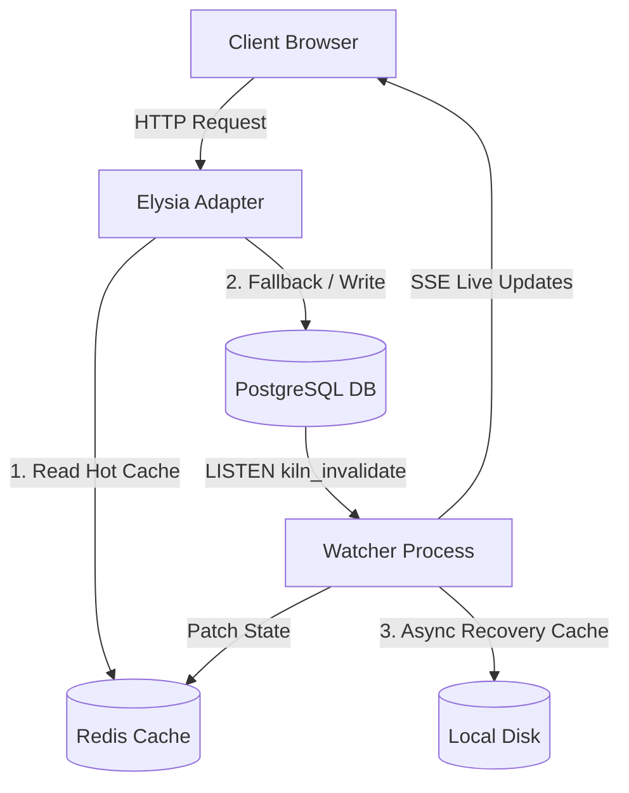

# FSR.js System Architecture

FSR.js is a TypeScript monorepo implementing **Field-Selective Rendering (FSR)** for the JavaScript/Bun ecosystem. It is the JavaScript port of Kiln's FSR paradigm, allowing field-level rendering granularity at the HTML baking layer.

## Monorepo Package Layout

The codebase is structured into the following packages under the `packages/` directory:

*   **[packages/core](file:///Users/jagjeet/Development/workspaces/Kiln/packages/core)**: Core primitives, configuration setups (`defineConfig`, `loadConfigFromEnv`), error handling abstractions (`Result<T>`), and the [LiveProp](file:///Users/jagjeet/Development/workspaces/Kiln/packages/core/src/live-prop.ts) definition.
*   **[packages/engine](file:///Users/jagjeet/Development/workspaces/Kiln/packages/engine)**: Stateful backend logic containing:
    *   [FsrStore](file:///Users/jagjeet/Development/workspaces/Kiln/packages/engine/src/store.ts): Manages PostgreSQL interaction for caching state metadata.
    *   [RedisCache](file:///Users/jagjeet/Development/workspaces/Kiln/packages/engine/src/cache.ts): Redis connection wrapper and cache operations.
    *   [FsrWatcher](file:///Users/jagjeet/Development/workspaces/Kiln/packages/engine/src/watcher.ts): Supervisor process that reconciles stale state and issues updates.
    *   [baking.ts](file:///Users/jagjeet/Development/workspaces/Kiln/packages/engine/src/baking.ts): Server rendering of layout and page components to static HTML templates.
    *   [hub.ts](file:///Users/jagjeet/Development/workspaces/Kiln/packages/engine/src/hub.ts): Server-Sent Events (SSE) stream coordinator for pushing live patches.
    *   [db-notify.ts](file:///Users/jagjeet/Development/workspaces/Kiln/packages/engine/src/db-notify.ts): Listen/notify pipeline for database triggers.
*   **[packages/adapter-elysia](file:///Users/jagjeet/Development/workspaces/Kiln/packages/adapter-elysia)**: Elysia-specific middleware, route registration, and SSE response handling.
*   **[packages/routekit](file:///Users/jagjeet/Development/workspaces/Kiln/packages/routekit)**: Route graph compilation, discovery, and HTTP request negotiation.
*   **[packages/react](file:///Users/jagjeet/Development/workspaces/Kiln/packages/react)**: Frontend React hooks (`useLive`, `useSubmit`).
*   **[packages/client](file:///Users/jagjeet/Development/workspaces/Kiln/packages/client)**: Browser runtime (`silcrow.js`) that connects to the SSE stream and surgically patches DOM elements.
*   **[packages/cli](file:///Users/jagjeet/Development/workspaces/Kiln/packages/cli)**: Scaffolding and development server utilities.

---

## 3-Layer Storage Model

FSR.js operates on a strict three-tier storage model to guarantee performance and multi-instance scaling:



1.  **Redis** (Serve Layer + Event Bus): Source of truth for baked HTML/JSON on promoted routes. Handles SSE updates and invalidation notifications. Redis is **required** infrastructure.
2.  **PostgreSQL**: Durable metadata database storing cache state, dependency links, hit counts, and real application data.
3.  **Local Disk**: Recovery storage containing async write-behind backups from Redis. Used only on cold starts.

---

## Schema Structures

### Database Schema (`kiln_fsr`)

All cache metadata is persisted in a single table:

```sql
CREATE TABLE kiln_fsr (
  route           TEXT,
  slot            TEXT,          -- '' = route-level, 'field_name' = slot-level
  query           TEXT,          -- SQL query to re-execute on invalidation
  query_params    JSONB,
  depends_on      TEXT[],        -- Array of dependency keys (e.g. 'contacts:id=42')
  stale           BOOLEAN DEFAULT FALSE,
  version         INT DEFAULT 1,
  hit_count       INT DEFAULT 0,
  promoted        BOOLEAN DEFAULT FALSE,
  promote_after   INT,           -- Hit threshold before caching (0 = SSG, NULL = SSR)
  debounce_secs   INT,
  html_path       TEXT,          -- Path to baked HTML shell on disk
  json_path       TEXT,          -- Path to baked JSON data on disk
  checksum        TEXT,
  last_hit        TIMESTAMPTZ,
  purge_after     INT,           -- TTL before cache eviction
  PRIMARY KEY (route, slot)
);
```

### Redis Key Schema

*   `kiln:html:<route>`: String holding full baked HTML.
*   `kiln:json:<route>`: String holding baked JSON (if JSON mode is active).
*   `kiln:slot:<route>`: Hash containing field slot values `{ slot_name: value }`.
*   `kiln:meta:<route>`: Hash containing route version, baked timestamp, and promotion state.

---

## Cache Invalidation Pipeline

```
[Application Database Mutation]
  │
  ├─► Trigger / Transaction writes event to `contact_events`
  └─► SQL Trigger issues: pg_notify('kiln_invalidate', '{"depKey": "contacts", "id": 42, "op": "UPDATE"}')
        │
        ▼
[db-notify.ts: startDbNotificationPipeline]
  │
  ├─► Receives PG notification payload
  └─► Resolves dependency key and calls watcher.notifyChange("contacts:id=42")
        │
        ▼
[FsrWatcher: watcher.ts]
  │
  ├─► Sets `stale=TRUE` in database where `depends_on` matches key
  ├─► Publishes payload to Redis channel `kiln:invalidate`
  ├─► Re-runs SQL queries for stale slots
  ├─► Re-bakes dynamic slot values to Redis hash and disk
  └─► Publishes patch payload to Redis channel `kiln:patch`
        │
        ▼
[hub.ts: SSE Hub]
  │
  ├─► Receives Redis patch message
  └─► Pushes SSE `patch` event to all active browsers matching route
        │
        ▼
[silcrow.js: Client Patcher]
  │
  └─► Surgically mutates DOM elements containing `s-live="slot_name"`
```
